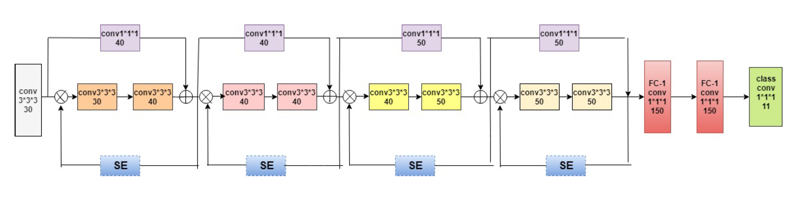

# AmygNet SE TDM
As one of the core technologies of deep learning, attention mechanism can effectively improve the accuracy and efficiency of the segmentation of image structures. I implemented squeeze and excitation network and top-down modulation to improve the small objects' segmentation ability of the AmygNet. AmygNet ability on amygdaloid body identification and segmentation in brain MRIs was improved

## AmygNet SE

## Citation: 
Liu Y, Nacewicz BM, Zhao G, Adluru N, Kirk GR, Ferrazzano PA, Styner MA and Alexander AL (2020) A 3D Fully Convolutional Neural Network With Top-Down Attention-Guided Refinement for Accurate and Robust Automatic Segmentation of Amygdala and Its Subnuclei. Front. Neurosci.14:260. doi: 10.3389/fnins.2020.00260

Maltbie, E., Bhatt, K., Paniagua, B., Smith, R. G., Graves, M. M., Mosconi, M. W., et al. (2012). Asymmetric bias in user guided segmentations of brain structures. Neuroimage 59, 1315–1323

Krizhevsky, A., Sutskever, I., and Hinton, G. E. (2012). Imagenet classification with deep convolutional 446 neural networks. In Advances in neural information processing systems. 1097–1105

Simonyan, K. and Zisserman, A. (2014). Very deep convolutional networks for large-scale image 508 recognition. arXiv preprint arXiv:1409.1556

He, K., Zhang, X., Ren, S., and Sun, J. (2016). Deep residual learning for image recognition. In 426 Proceedings of the IEEE conference on computer vision and pattern recognition. 770–778 Bahdanau, D., Cho, K., and Bengio, Y. (2014). Neural machine translation by jointly learning to align and 379 translate. arXiv preprint arXiv:1409.0473

Hu, J., Shen, L., and Sun, G. (2018). Squeeze-and-excitation networks. In 2018 IEEE/CVF Conference on 431 Computer Vision and Pattern Recognition (IEEE). doi:10.1109/cvpr.2018.00745

Nacewicz, B. M., Dalton, K. M., Johnstone, T., Long, M. T., McAuliff, E. M., Oakes, T. R., et al. (2006). 481 Amygdala volume and nonverbal social impairment in adolescent and adult males with autism. Archives 482 of general psychiatry 63, 1417–1428

